# dsh-webui-mobile

让 DeepSeek Harness 的 Web 界面在手机 / 窄屏（视口宽度 ≤ 1023px）下像原生 App 一样好用，**桌面端完全不受影响**。

[](https://www.npmjs.com/package/dsh-webui-mobile)
[](./LICENSE)

- 纯客户端 Cordis 插件，无 npm 依赖、无构建步骤
- 所有视觉改动都收在 `@media (max-width:1023px)` + 移动端作用域（`html.dsh-mobile-shell`）内，**桌面端零变化**
- 移动端布局改动不做硬编码，采用**类名无关的通用适配**——任何插件以后新增的标签页 / 内容被挤压时都会被自动接住

## 更新记录

- **v0.4.0**：**WebUI 工具**（长按悬浮球或 通用设置→WebUI 工具 打开）——app 网格卡片（可扩展）：**字号缩放**（长按悬浮球→工具卡，字号驱动重排、持久化）、**底栏信息**（缓存命中·输入输出 / 轮·步·LLM·工具调用 / 首 token 平均 三行独立开关，关闭后底栏空位释放、输入框下移）、**面包屑优化**（多级子代理面包屑单字母代号+两段式，可开关）、**上传图片**（显示/隐藏输入栏上传按钮）、**关于**（固定最尾端，插件与各 app 介绍）。另：自定义主题支持【原生主题】回退。桌面端原生。
- **v0.3.9**：外观主题（个性化）—— 浅深**合并为 toggle**、保留**跟随系统**、新增**自定义**；自定义卡含 3 套预设主题（晴空蓝/青草绿/樱粉白，各一套统一和谐的 CSS 变量色板）+ 8 色**调色板**；主题由软件单一 accent 经 color-mix 派生，风格统一无撞色；选择持久化。主题卡只显示短名、明暗双色预览（暗半块按主题色相，非纯黑）。
- **v0.3.8**：Agent 预设卡片修复 + 排版稳定 —— 禁长按文本选择/复制提示、卡内描述可直接滚动、「查看」弹出详细文字(修复被设置面板遮挡)、「复制/赋值」可点，多张预设卡同宽同高、长内容不错位溢出、按钮区更紧凑。
- **v0.3.7**：增强移动端**模型页显示效果** —— 模型编辑卡更紧凑（模型块单行紧排、输入等高、无大片空白）、长值（模型名 / API 地址）完整可读（超长用 tooltip）、API 密钥保持掩码不为明文、修复「添加模型」触发的高频闪烁/重影。
- **v0.3.6**：多层子代理面包屑单字母命名法（主代理 / A / B）+ 两段式点击（点某层显示全名 → 再点跳转/展开下级、点别处还原、点计数展开子代理列表）。

---

## 功能演示

### 1. 移动端聊天主界面

全宽聊天流 + 悬浮可拖动的「小鲸鱼」菜单按钮（点击/下拉打开侧边栏）、模型/访问模式选择、完整输入栏。

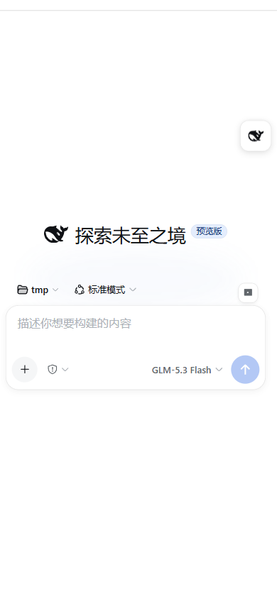

### 2. 图片上传

输入栏右上角的小方图片按钮，直接从相册/拍照上传图片；图片以竖排悬浮在输入框上方，不挤占输入框。

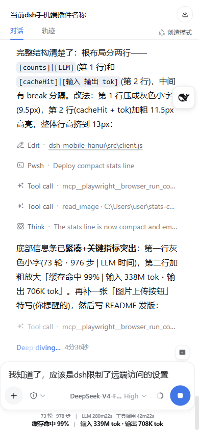

### 3. 会话抽屉（侧边栏）

抽屉固定 302px 宽度（不再随工作区加载而跳动），带一层半透明遮罩，可触摸滑动关闭。

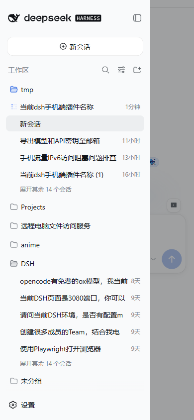

### 4. 设置面板 · 通用设置

顶部为横向标签导航条（重置原位 + 右上角关闭 X），内容单列：
- 行距紧凑、下拉控件靠右
- 「外观」浅色 / 深色 / 跟随系统横排三个按钮（不再竖排占空间）
- 「打开配置文件」从顶部大按钮移入列表底部，不占导航栏


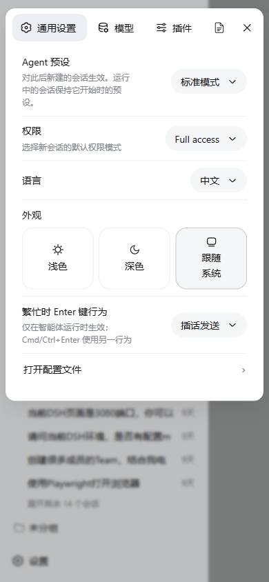

### 5. 模型

设置卡片近全宽居中，提供方列表 + 编辑/删除操作在窄屏正常排布。

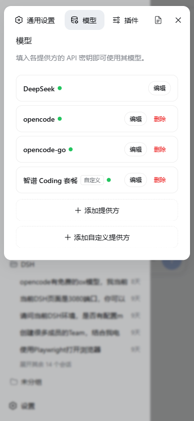

### 6. 插件列表

插件名**完整可读**（include / typert-registry / session-title-first-prompt-llm …），名字独占一行、状态徽章换行到下方——不再出现 "incl..."、"ses..." 这类截断。

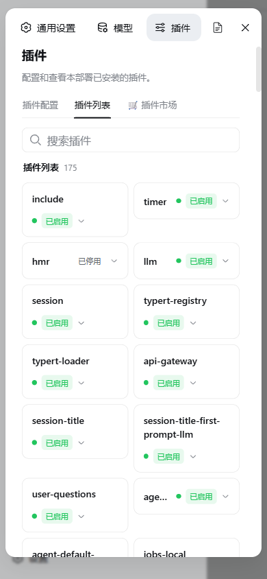

### 7. MCP 服务器

服务器名完整显示（proxy / mailbridge / bilinote / dashscope_asr / playwright），不再被压缩成 "p..."、"b..."。

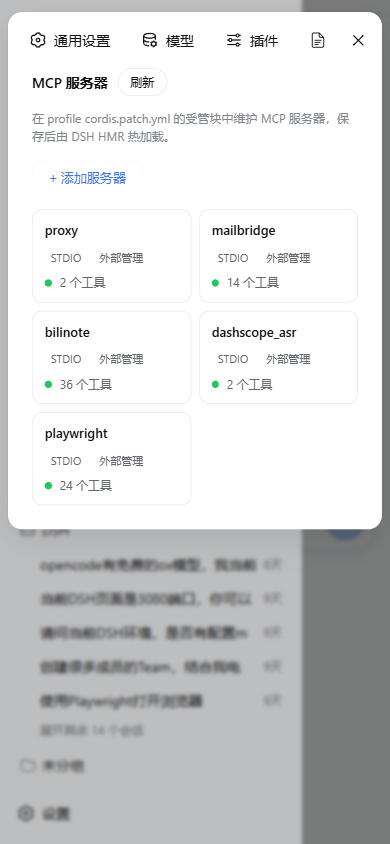

### 8. 技能列表（含展开）

技能卡片两列排布、名称完整；点击展开时该卡片**横跨整行**——详情块（YAML/描述）在宽行里可读、限高内部滚动，其余卡片保持紧凑、间距不被撑大。

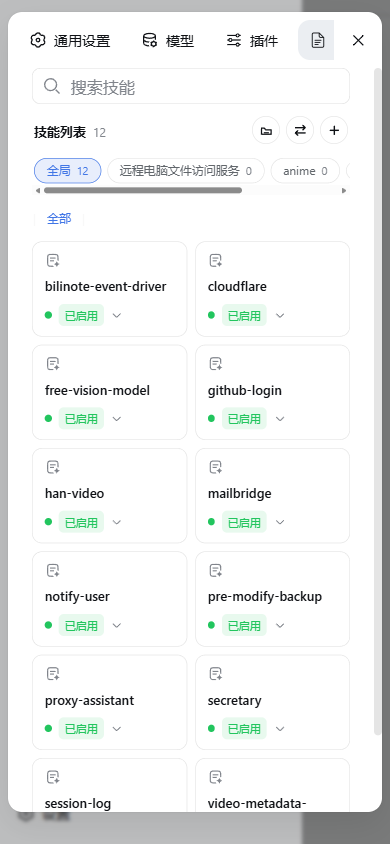
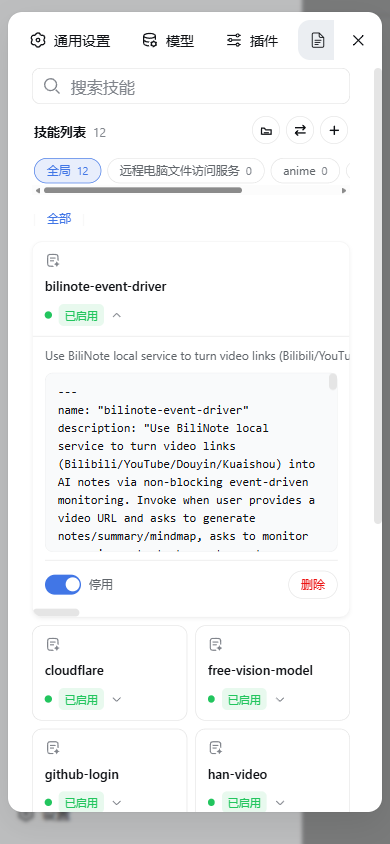

### 9. Agent 预设

预设卡片 2×2 排布，**四张卡片完全一致**（同宽同高）：标题横排、徽章换行到第二行、描述统一两行截断。


### 10. 会话管理

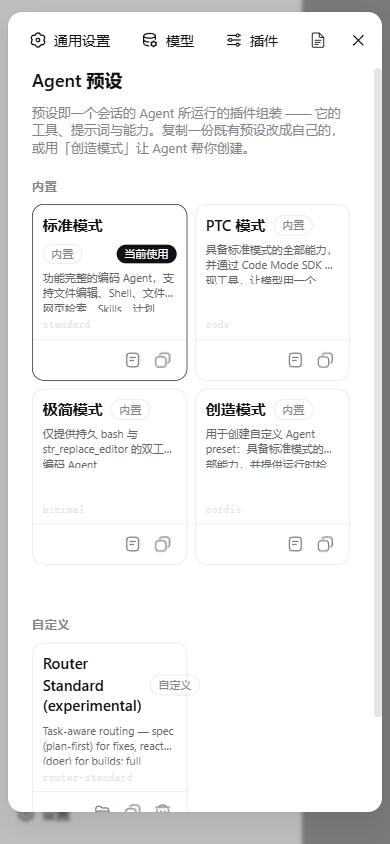

### 11. 底部用量信息（紧凑 + 高亮关键指标）

聊天底部用量条压成两行：第一行灰色小字（轮/步、LLM/工具耗时），第二行**加粗高亮**「缓存命中 / 输入 token / 输出 token」三项成本指标。

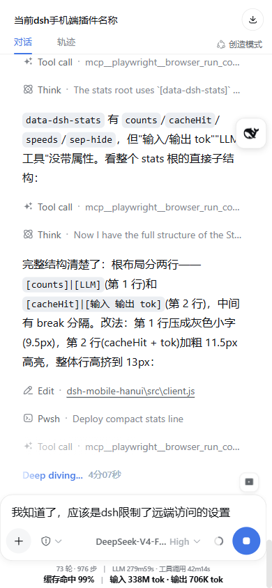

### 12. 桌面端不受影响

宽视口（≥1024px）完全保持 DSH 原生桌面布局，无任何改动。

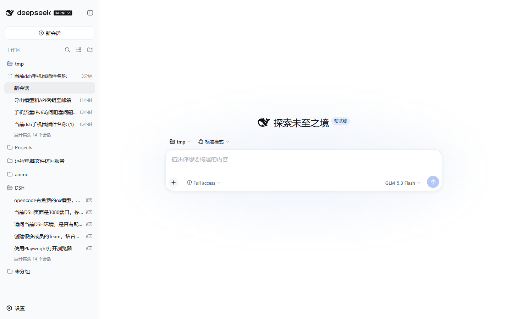

---

## 通用适配机制（为什么以后新增的标签页也不会坏）

插件对移动端内容做的是**类名无关的通用处理**，而不是针对某个 CSS 类写死：

- **挤压修复**：扫描面板内的文字叶子，凡是"被所在行挤到不可读"（横向截断成一条缝、或竖排成一个字一列、或省略号只剩不到 5 个字符宽），自动让所在行换行、文字独占全宽一行、徽章/按钮换行到下方。
- **溢出适配**：任何块级内容右缘超出设置卡片时，整体等比缩小（字号 + 图标一起缩，下限 0.72）。
- **展开卡片横跨整行**：带详情块的可展开卡片自动占满一行，避免详情被塞在窄列里。

这些机制与具体插件无关——任何第三方插件以后往设置里注册新的标签页 / 列表 / 卡片，内容一被挤压就会被这套规则接住。

---

## 做了什么

- 侧边栏、详情面板变成左右抽屉（固定 302px，遮罩分离，触摸滑动关闭），不再挤压聊天区
- 悬浮可拖动的「小鲸鱼」菜单按钮，点击/下拉打开侧边栏
- 设置等弹窗近全宽居中卡片显示，不被抽屉裁剪
- 上滑到顶部自动加载更早对话；切换会话不自动弹软键盘
- 子代理目录、模型选择、推理等级、模式选择在小屏正常显示
- 输入框右上角图片按钮，可上传图片并竖排悬浮，不挤占输入框
- 底部用量信息紧凑化，高亮「缓存命中 / 输入 / 输出」三项
- 导航栏保持原生、所有标签页内容类名无关的通用适配

## 安装

```bash
cd ~/.dsh/profiles/web
pnpm add dsh-webui-mobile
```

然后在 `~/.dsh/profiles/web/package.json` 的 `dsh.profile.bundles` 数组里加入 `"dsh-webui-mobile"`，重启 `dsh web` 服务。

安装并重启后，用手机打开 DSH 网页即自动生效（视口 ≤1023px），无需其它配置。

## 临时关闭

- 在网址后加 `?mobileShell=0`，或
- 在浏览器控制台执行 `localStorage.setItem('dsh-mobile-shell', '0')` 后刷新。

## 更多

- 详细部署、加载机制、开发与发布、故障排查见 [AGENTS.md](./AGENTS.md)
- [npm 包页](https://www.npmjs.com/package/dsh-webui-mobile)

MIT License
